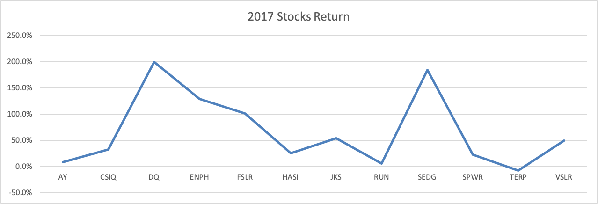
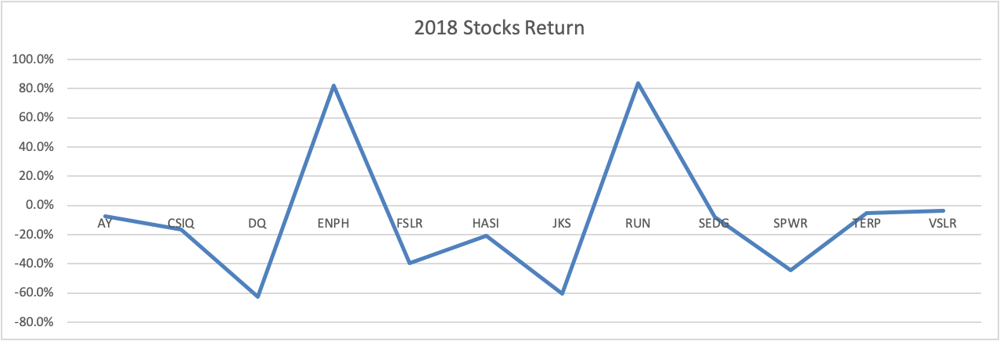
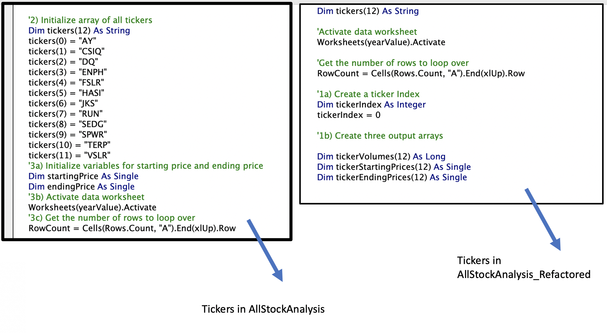

# An Analysis of Stock Data with VBA

## Overview of Project 

This project aims to analyze the data of different Wall Street Green Stocks to uncover trends. We edit the Module 2 solution VBA code to loop through all the data one time to collect the same information, but more efficiently, taking fewer steps and using less memory. 

## Results

Based on our analysis results, we can observe that in 2017, the Green Stocks' return was significantly higher than in 2018. In 2017, only TERP stocks showed a negative return, while in 2018, most of the stocks (except for ENPH and RUN) had a negative return. 

We can also notice that even when ENPH stocks return decreased in 2018 compared to 2017, in both years the return is over 80%, while the RUN stock went from 5.5% in 2017 to 84.0% in 2018. Due to the drastic increment of the RUN stock, ENPH seems like a more stable stock to invest in, since there are more factors that need to be considered (value of the stocks, revenues, etc.) See Graph 1 - 2017 Stocks Return and Graph 2 - 2018 Stocks Return. 

*Graph - 1 2017 Stocks Return

*Graph - 1 2018 Stocks Return

This analysis was performed more efficiently, creating a tickerIndex to access the tickers across the different arrays instead of identifying all the tickers on our code one by one, saving time and memory. See figure 1 — Tickers Difference between AllStockAnalysis and AllStockAnalysis_Refactored.

*Fig. 1 ickers Difference between AllStockAnalysis and AllStockAnalysis_Refactored.*

We went from 0.625 seconds for the year 2018 to 0.1054688 seconds with the refactored code when measuring the code performance. And from 0.625 seconds for the year 2017 vs. 0.109375 seconds with the refactored code. See Fig 3 - Refactored 2017 Results & Fig 4 - Refactored 2018 Results.

Resources/VBA_Challenge_2017.png
*Fig. 3 - Refactored 2017 Results*

Resources/VBA_Challenge_2018.png
*Fig. 4 - Refactored 2018 Results*

##Summary: In a summary statement, address the following questions.

After editing our code or refactoring it, the code is shorter and easier to read. Therefore, it is easier to maintain and share with other people. However, it isn't easy to know what to address and can take a lot of time. And if when the original code was written, there were no explanations or comments added, it could be challenging to decipher the intention of a code line. 

In the original script, the challenge of understanding the code was not present since we used good practices of describing the objective of the code, making it easier to know what to do or change. And with the results of the code performance, we can notice how we saved time. Overall, refactoring brings more pros than cons because it aims to make processes more efficient. 

